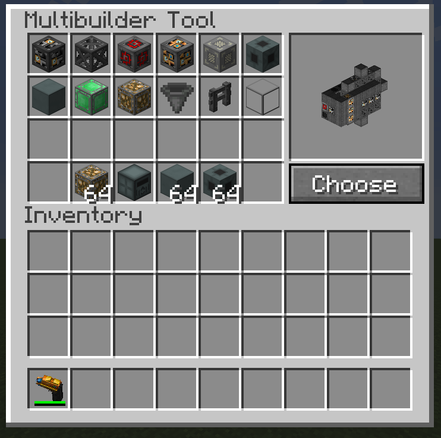
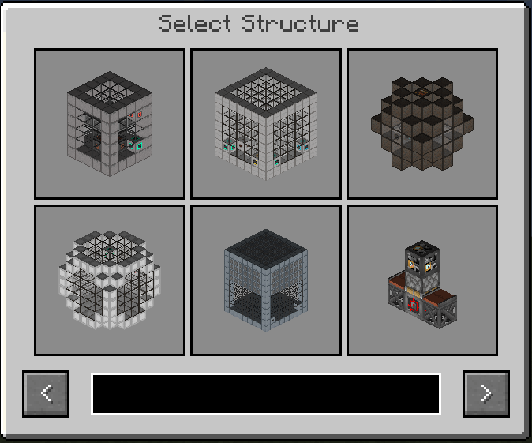
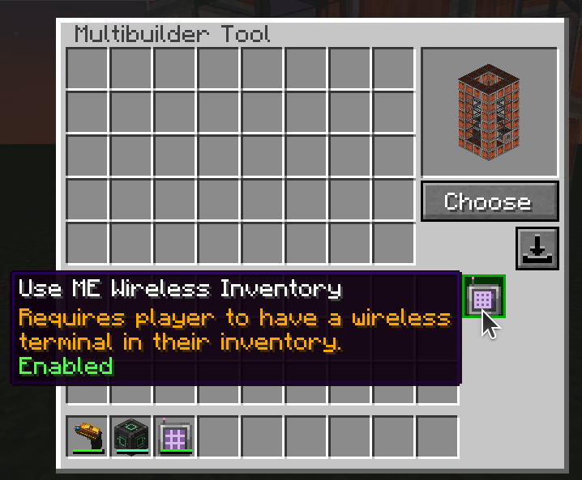
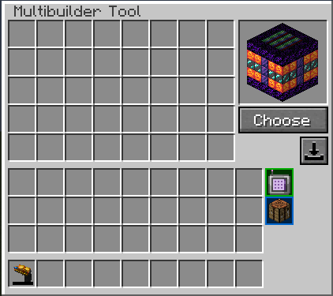

---
navigation:
  title: Multibuilder Tool
  icon: 'mbtool:mbtool'
categories:
   - Guide
item_ids:
   - mbtool:mbtool
---

# Multibuilder Tool

Tired of building numerous structures by hand?

## [Video Tutorial](https://www.youtube.com/watch?v=eM896IoOGvI)

# Description
* SHIFT+use to open GUI

* SHIFT+SCROLL to rotate structure before placement

* Multibuilder Tool has own inventory where you store blocks needed for building

* Better structure selection GUI with search field and multiblocks previews

* Implemented server-client sync. When client joins the server, it will have only structures what server sent

* Allows to use AE2 ME storage for buildings if you have linked Wireless terminal in your inventory
* Needs to be enabled!

* You can autocraft missing blocks if you have the patterns in your ME system.
* Needs to be enabled!